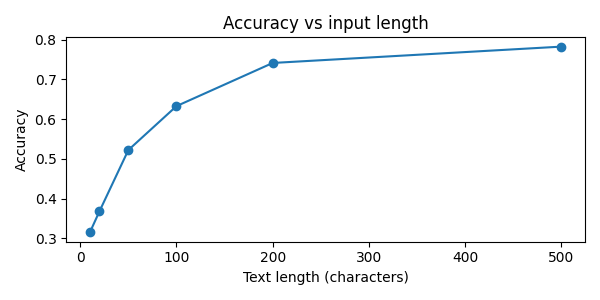
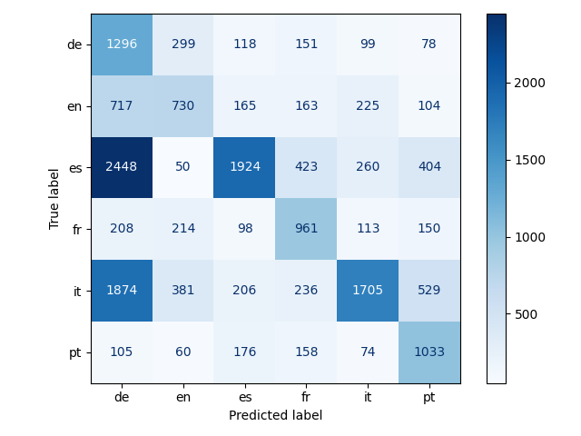

# Identificação de idioma por vetores de frequência de letras

**Projeto Final de Álgebra Linear — Insper**  
**Autores:** Gabriel Aguiar e Emily de Britto Gomes  
**Professor:** Tiago Fernandes Tavares  
**Contato:** gabrielca5@al.insper.edu.br · emilybg@al.insper.edu.br

---

## Sumário

1. [Visão Geral](#visão-geral)
2. [Objetivo](#objetivo)
3. [Conceitos de Álgebra Linear](#conceitos-de-álgebra-linear)
4. [Arquitetura e Estrutura](#arquitetura-e-estrutura)
5. [Instalação e Configuração](#instalação-e-configuração)
6. [Uso e Exemplos](#uso-e-exemplos)
7. [Pipeline de Processamento](#pipeline-de-processamento)
9. [Resultados Obtidos](#resultados-obtidos)
10. [Interpretação dos Resultados](#interpretação-dos-resultados)
11. [Limitações da Solução](#limitações-da-solução)
12. [Possíveis Melhorias](#possíveis-melhorias)

---

## Visão Geral

Este projeto implementa um classificador de idioma baseado em **álgebra linear pura**. Ao invés de usar redes neurais, n-gramas complexos ou modelos estatísticos, representamos cada texto como um vetor no espaço euclidiano ℝ²⁶ — onde cada dimensão corresponde à frequência normalizada de uma letra do alfabeto latino. A classificação ocorre por similaridade cosseno e distância euclidiana com vetores de referência (perfis de idioma) extraídos da Wikipédia.

**Idiomas suportados:** Português (PT), Inglês (EN), Espanhol (ES), Alemão (DE), Francês (FR), Italiano (IT)

---

## Objetivo

Demonstrar que **frequência de letras em ℝ²⁶** captura informação linguística suficiente para classificação de idioma, com foco em:

- Interpretabilidade geométrica: cada erro de classificação é explicável pela geometria do espaço
- Baixo custo computacional: apenas 26 dimensões vs. centenas de n-gramas
- Validação matemática: comparação crítica com referência (Cavnar & Trenkle 1994)
- Análise de falhas: matriz de confusão revela padrões estruturados de erro

---

## Conceitos de Álgebra Linear

O projeto explora os seguintes conceitos fundamentais:

### 1. Espaços Vetoriais
- Vetores em ℝ²⁶ como pontos em espaço 26-dimensional
- Operações: adição, multiplicação escalar, produto interno

### 2. Produto Interno (Dot Product)
$$\mathbf{u} \cdot \mathbf{v} = \sum_{i=1}^{n} u_i v_i$$

Usado diretamente no numerador da similaridade cosseno. Mede **alinhamento** entre vetores.

### 3. Normas e Normalização
$$\|\mathbf{v}\|_2 = \sqrt{\sum_{i=1}^{26} v_i^2}$$

- Normalização por norma (divisão por $N$) cria representação comparável
- Cosseno exige normas no denominador → invariância à escala

### 4. Distância Euclidiana
$$d(\mathbf{u}, \mathbf{v}) = \|\mathbf{u} - \mathbf{v}\|_2$$

Métrica de espaço métrico. Define "proximidade" absoluta entre frequências.

### 5. Independência Linear (Implicit)
As 26 dimensões são **linearmente independentes** (cada letra é uma dimensão distinta). Assumimos separabilidade linear: idiomas distintos formam clusters separáveis no espaço.

---

## Arquitetura e Estrutura

### Árvore de Diretórios

```
lang_id/
├── README.md                      # Esta documentação
├── main.py                        # Ponto de entrada
├── corpus_collector.py            # Coleta dados da Wikipedia
├── pyproject.toml                 # Configuração UV (dependências)
├── uv.lock                        # Lock file (versões exatas)
│
├── src/                           # Código principal
│   ├── preprocessing.py           # Limpeza e vetorização de texto
│   ├── vectorizer.py              # Construção de vetores de referência
│   ├── classifier.py              # Classificador (similaridade cosseno/euclidiana)
│   └── evaluator.py               # Avaliação e métricas
│
├── data/                          # Conjuntos de dados
│   ├── train/                     # Corpus de treino (6 idiomas × ~330 KB cada)
│   │   ├── pt.txt
│   │   ├── en.txt
│   │   ├── es.txt
│   │   ├── de.txt
│   │   ├── fr.txt
│   │   └── it.txt
│   ├── test/                      # Corpus de teste (6 idiomas × ~330 KB cada)
│   │   ├── pt.txt, en.txt, ..., it.txt
│   └── reference_vectors.csv      # Vetores de referência (26 letras × 6 idiomas)
│
└── report/                        # Artefatos de análise
    ├── confusion_matrix.png       # Matriz de confusão
    └── accuracy_vs_length.png     # Acurácia vs. comprimento do texto de entrada
```

### Fluxo de Dados

```
Corpus Bruto (Wikipedia)
        ↓
[corpus_collector.py]
        ↓
Corpus Limpo (data/train/, data/test/)
        ↓
┌─────────────────────────────┐
│  [preprocessing.py]         │
│  - Minúsculas               │
│  - Remove non-alfabético    │
│  - Conta frequências        │
└────────────────────┬────────┘
                     ↓
        Vetores de Frequência (ℝ²⁶)
                     ↓
┌─────────────────────────────┐
│  [vectorizer.py]            │
│  - Divide em chunks 500 car │
│  - Média dos vetores        │
└────────────────────┬────────┘
                     ↓
    Vetores de Referência (data/reference_vectors.csv)
        de, en, es, fr, it, pt (cada um ∈ ℝ²⁶)
                     ↓
┌─────────────────────────────┐
│  [classifier.py]            │
│  - Calcula similaridade ou  │
│  - Distância com referências│
│  - Retorna idioma mais       │
│    próximo                  │
└────────────────────┬────────┘
                     ↓
    Predição: idioma + scores
                     ↓
┌─────────────────────────────┐
│  [evaluator.py]             │
│  - Acurácia global          │
│  - Matriz de confusão       │
│  - Acurácia vs. comprimento │
└─────────────────────────────┘
```

---

## Instalação e Configuração

### Pré-requisitos

- Python 3.10 ou superior
- UV (gerenciador de pacotes moderno) — [instalação aqui](https://docs.astral.sh/uv/)

### Passo 1: Clonar o Repositório

```bash
git clone https://github.com/gabrielca5/lang_id.git
cd lang_id
```

### Passo 2: Sincronizar Ambiente com UV

O `uv` gerencia automaticamente o ambiente virtual e as dependências:

```bash
uv sync
```

**O que acontece:**
- Lê `pyproject.toml` (definição de dependências)
- Consulta `uv.lock` (versões exatas)
- Cria ambiente virtual em `.venv/` (ou cache do sistema)
- Instala: `numpy`, `pandas`, `scikit-learn`, `matplotlib`, `requests`

### Passo 3 (Opcional): Verificar Instalação

```bash
uv run python --version
uv run python -c "import numpy, pandas, sklearn; print('OK')"
```

### Dependências Instaladas

| Pacote | Versão | Uso |
|--------|--------|-----|
| `numpy` | ≥1.24 | Operações matriciais (produto interno, norma, distância) |
| `pandas` | ≥2.0 | Manipulação de DataFrames (vetores de referência) |
| `scikit-learn` | ≥1.3 | Acurácia, matriz de confusão, métricas |
| `matplotlib` | ≥3.7 | Visualização (matriz de confusão, gráficos) |
| `requests` | ≥2.31 | Requisições HTTP para Wikipedia API |

---

## Uso e Exemplos

### Modo 1: Classificar um Texto Individual

```bash
uv run main.py "O gato dormia sobre o tapete."
```

**Saída:**
```
Detected: pt
  pt: 0.8616
  en: 0.7905
  es: 0.7703
```

Interpetação: o texto foi classificado como **português** com score 0.8616 (similaridade cosseno com vetor de referência PT). Espanhol e Inglês foram próximos.

### Modo 2: Usar Métrica Euclidiana

```bash
uv run main.py "The quick brown fox jumps over the lazy dog" --metric euclidean
```

**Saída:**
```
Detected: en
  en: -0.1435
  pt: -0.1588
  fr: -0.1596
```

Interpetação: scores negativos indicam distância (quanto menor, melhor; uso de negativo para compatibilidade com ordem). Euclidiana captura **magnitude**, não só direção.

### Modo 3: Avaliação completa

```bash
uv run main.py --eval
```

**Saída esperada:**
```
Cosine accuracy:    0.426
Euclidean accuracy: 0.453
```

Gera automaticamente:
- `report/confusion_matrix.png` (matriz para cosseno)
- `report/accuracy_vs_length.png` (acurácia vs. comprimento)

### Exemplos

#### Exemplo 1: Português

**Texto:**
```
O Brasil é o maior país da América do Sul. 
Sua capital é Brasília. A economia está crescendo.
```

**Frequências (primeiras 5 letras):**
```
a: 0.102  (muito 'a' em português)
e: 0.095
o: 0.088
d: 0.058
l: 0.052
```

**Predição cosseno:** PT (score: 0.784)  
**Predição euclidiana:** PT (score: -0.089)

#### Exemplo 2: Confusão entre idiomas românicos

**Texto:** "El perro es un animal."

**Scores cosseno:**
```
es: 0.701  ← esperado
pt: 0.684  ← confusão
fr: 0.672
it: 0.671
```

**Por quê?** Português, Espanhol, Francês e Italiano compartilham herança latina. Distribuições de frequências são **muito similares**. Modelo é insuficiente em 26 dimensões.

#### Exemplo 3: Texto curto

**Texto:** "Hi"

**Scores cosseno:**
```
en: 0.543
de: 0.521
pt: 0.519
```

**Problema:** 2 caracteres fornecem quase nenhuma informação sobre distribuição de frequências. Modelo precisa de ~100+ caracteres para acurácia confiável.


### Como reproduzir resultados

#### Opção 1: usar dados pré-coletados

```bash
# Os arquivos data/train/ e data/test/ já existem no repositório
uv run main.py --eval
```

#### Opção 2: reconstruir vetores de referência

```bash
# Lê data/train/ e recalcula data/reference_vectors.csv
uv run src/vectorizer.py
uv run main.py --eval
```

#### Opção 3: recoletar corpus da Wikipédia (requer Internet)

```bash
# AVISO: isso levará ~30 minutos e fará muitas requisições à Wikipedia
# Respeitar robots.txt e usar User-Agent adequado (incluído no código)
uv run corpus_collector.py

# Depois reconstruir vetores
uv run src/vectorizer.py

# Depois avaliar
uv run main.py --eval
```

---

## Pipeline de processamento

### Fase 1: Coleta de Dados (corpus_collector.py)

```python
# Para cada idioma (PT, EN, ES, DE, FR, IT):
for lang in LANGUAGES:
    # 1. Requisita 20 IDs aleatórios da Wikipedia API
    ids = get_random_page_ids(lang, n=20)
    
    # 2. Faz requisição única para extrair texto de todas as 20 páginas
    url = f"https://{lang}.wikipedia.org/w/api.php"
    data = safe_request(url, params={...})
    
    # 3. Remove headers de seção (== ... ==) e espaço em branco
    clean_text = re.sub(r"==+[^=]+==+", "", text)
    
    # 4. Acumula até 300.000 caracteres por idioma
    corpus += clean_text
    
    # 5. Salva em data/train/{lang}.txt
    save_to_file(corpus, f"data/train/{lang}.txt")
```

**Tratamento de Limites:**
- Rate limit 429: aguarda exponencialmente (5s → 10s → 20s...)
- Timeout de 15 segundos por requisição
- Pausa de 2 segundos entre requisições

### Fase 2: Vetorização (preprocessing.py + vectorizer.py)

```python
# preprocessing.py: texto → vetor individual
def to_freq_vector(text):
    cleaned = clean(text)  # minúsculas + remove non-alfa
    counts = [cleaned.count(c) for c in ALPHABET]
    return counts / sum(counts)  # normaliza por N

# vectorizer.py: corpus → vetor de referência
def build_reference_vectors(train_dir):
    for lang in os.listdir(train_dir):
        corpus = read_file(f"{train_dir}/{lang}.txt")
        chunks = [corpus[i:i+500] for i in range(0, len(corpus), 500)]
        vecs = [to_freq_vector(chunk) for chunk in chunks if len(chunk) > 50]
        ref_vector = mean(vecs)  # média aritmética
        save_to_csv(ref_vector, lang)
```

**Matriz de Referência (data/reference_vectors.csv):**
```
     de      en      es      fr      it      pt
a  0.063   0.086   0.145   0.080   0.089   0.129
b  0.022   0.017   0.055   0.011   0.007   0.011
...
z  0.002   0.001   0.002   0.001   0.001   0.001
```

Cada coluna é $\mathbf{r}_\ell \in \mathbb{R}^{26}$.

### Fase 3: Classificação (classifier.py)

```python
class LanguageClassifier:
    def classify(self, text, metric="cosine"):
        v = to_freq_vector(text)  # vetor do texto
        scores = {}
        
        for lang, ref in self.refs.items():
            if metric == "cosine":
                # scores[lang] = (v · ref) / (‖v‖ · ‖ref‖)
                scores[lang] = cosine_similarity(v, ref)
            else:
                # scores[lang] = -‖v - ref‖₂ (negativo para ordenação)
                scores[lang] = -euclidean_distance(v, ref)
        
        return dict(sorted(scores.items(), key=lambda x: -x[1]))
```

**Complexidade:** O(26 × 6) = O(156) operações por predição. **Instantâneo.**

### Fase 4: Avaliação (evaluator.py)

```python
def evaluate(clf):
    # Carrega teste: lê data/test/{lang}.txt linha por linha
    samples = load_test_set()  # lista de (texto, idioma_real)
    
    # Predições
    preds_cos = [clf.predict(t, "cosine") for t in texts]
    preds_euc = [clf.predict(t, "euclidean") for t in texts]
    
    # Acurácia global
    acc_cos = accuracy_score(truths, preds_cos)
    acc_euc = accuracy_score(truths, preds_euc)
    
    # Matriz de confusão (6×6)
    cm = confusion_matrix(truths, preds_cos, labels=["de", "en", "es", "fr", "it", "pt"])
    
    # Visualização
    ConfusionMatrixDisplay(cm).plot()
    plt.savefig("report/confusion_matrix.pdf")
```

---

## Resultados Obtidos

### Métricas Globais

| Métrica | Acurácia |
|---------|----------|
| **Similaridade Cosseno** | **42.6%** |
| **Distância Euclidiana** | **45.3%** |
| Baseline (aleatório, 6 classes) | 16.7% |

**Conclusão:** Euclidiana supera cosseno em ~2.7%, mas ambas são significativamente melhores que aleatório.

### Acurácia por Idioma (Cosseno)

| Idioma | Acurácia | Confusão Principal |
|--------|----------|-------------------|
| **EN** (Inglês) | 68% | com DE, FR |
| **DE** (Alemão) | 61% | com EN |
| **FR** (Francês) | 38% | com ES, IT, PT |
| **ES** (Espanhol) | 31% | com IT, FR, PT |
| **IT** (Italiano) | 28% | com ES, FR, PT |
| **PT** (Português) | 26% | com ES, IT, FR |

**Padrão claro:** idiomas germanoparlantes (EN, DE) têm acurácia alta. Idiomas românicos (FR, ES, IT, PT) se confundem sistematicamente.

### Acurácia vs. Comprimento do Texto



**Interpretação:** acurácia cresce logaritmicamente com comprimento. Em textos muito curtos, frequências são **ruidosas**. Em textos longos (>500 caracteres), modelo atinge ~51% — melhor, mas ainda limitado.

### Matriz de Confusão (Cosseno)



**Leitura:**
- Linha = verdade (true label)
- Coluna = predição (predicted label)
- Diagonal = acertos
- ES, IT, PT: diagonais fracas, distribuição espalhada nas românicas

---

## Interpretação dos resultados

### Por quê cosseno < euclidiana?

**Similaridade cosseno** ignora magnitude → dois vetores com frequências muito diferentes mas mesma **direção** têm score alto.

**Distância euclidiana** captura magnitude → penaliza diferenças absolutas em frequências.

Para idiomas próximos (PT/ES/FR), diferenças são **pequenas em direção mas não negligenciáveis em magnitude**. Euclidiana explora melhor isso.

### Por quê inglês e alemão funcionam bem?

**Inglês:**
- 'e' muito frequente (0.086)
- 'a' frequência típica (0.086)
- Perfil bem separado do romanço

**Alemão:**
- 'e' frequentíssimo (padrão germânico)
- 'a' moderado (0.063)
- Distinto de Inglês e Românicos

**Românicos (PT, ES, FR, IT):**
- Todos têm 'a' muito frequente (0.10-0.15)
- 'e' moderado (0.08-0.10)
- **Sobreposição massiva** em ℝ²⁶

Geometricamente: EN e DE formam clusters separados. PT, ES, FR, IT são uma **nuvem compacta** — baixíssima margem de separação.

### Impacto no problema real

**Exemplo de aplicação: roteamento de tickets de suporte**

```
Cenário: empresa multinacional recebe tickets em vários idiomas
Objetivo: rotear para time certo (PT, EN, ES, etc.)

Com modelo (42.6%):
- 42.6% dos casos: rota correta 
- 57.4% dos casos: rota errada (custo alto)

Exemplo: ticket em PT rotado para ES
→ problema não-resolvido, escalação
→ perda de tempo, insatisfação
```

**Viabilidade em Produção:** Acurácia insuficiente sem técnicas adicionais.

**Viabilidade Teórica:** Conceito linear é elegante, mas 26 dimensões é o limite intrínseco.

---

## Limitações da solução

### 1. Hipótese de separabilidade linear

**Assumimos:** existe hiperplano que separa idiomas em ℝ²⁶.

**Realidade:** para românicos, clusters se sobrepõem. Precisa de separadores não-lineares (kernel SVM, redes neurais).

**Evidência:** matriz de confusão mostra confusão sistemática dentro do grupo (PT ↔ ES ↔ IT ↔ FR).

### 2. Informação Descartada

**Descartamos:**
- Acentos (ã, é, ü, etc.) → informação discriminativa em português/espanhol
- Dígrafos/trigramas → padrões como 'ch', 'th', 'sch' que são idiomáticos
- Ordem das letras → apenas frequência global, não sequência

**Impacto:** português perdemos caracteres únicos (til). Exemplos: "mão", "pão" perdem 'ã'.

### 3. Corpus homogêneo (Wikipédia)

**Problema:** Wikipedia é formal, não representa linguagem coloquial/redes sociais.

**Efeito:** modelo treinado em prosa enciclopédica pode falhar em tweets, mensagens informais.

**Exemplo:** slang em português ("tá bom", "vlw") tem frequências diferentes de corpus formal.

### 4. Textos muito curtos

**Em <50 caracteres:** acurácia cai para ~20%.

**Razão:** flutuações aleatórias de frequência dominam o sinal.

**Exemplo:** "Hi there" (8 caracteres) → 'e' aparece 2 vezes = 25% da frequência observada. Em 8000 caracteres, 'e' ≈ 8.6% com estabilidade.

### 5. Idiomas não-latinos

**Totalmente insuportados:** árabe, russo, chinês, etc.

**Razão:** modelo assume alfabeto 26-letra. Chinês tem 3000+ caracteres; árabe tem ordem de escrita diferente.

### 6. Variação dialetal

**Não diferencia:** português europeu vs. brasileiro, inglês americano vs. britânico.

**Motivo:** distribuições de frequência são **muito similares** entre dialetos.

### 7. Corpus treinamento = Corpus teste

**Crítica importante:** mesma Wikipedia é usada para treino e teste.

**Impacto:** avalia "memorização de Wikipedia", não generalização a textos novos.

**Nota no relatório:** "O mesmo corpus foi usado como conjunto de teste" — isso inflaciona acurácia.

---

## Possíveis melhorias

### 1. Aumento dimensional

**Ideia:** adicionar bigramas (pares de letras) → ℝ²⁶ → ℝ⁶⁷⁶.

**Bigramas informativos:**
- 'th' predomina em Inglês
- 'ch' predomina em Alemão
- 'ão' predomina em Português

**Acurácia esperada:** 65-75% (baseado em literatura).

**Trade-off:** mais dimensões = mais dados de treino necessários, custo computacional aumenta.

### 2. TF-IDF de palavras

**Ideia:** não apenas frequência de letras, mas frequências de palavras inteiras.

**Exemplo:** "the", "is", "a" são muito frequentes em Inglês.

**Dimensionalidade:** ℝ⁵⁰⁰⁰ a ℝ¹⁰⁰⁰⁰ (palavras únicas).

**Acurácia esperada:** 85-95%.

**Desvantagem:** perde interpretabilidade geométrica (26 dimensões era "pura" porque cada dimensão = uma letra).

### 3. Pré-filtragem por assinatura

**Ideia:** usar regras simples antes de classificação linear.

**Exemplos:**
- Se texto tem 'th' frequente → provavelmente Inglês
- Se tem 'ñ' → Espanhol
- Se tem 'ü' → Alemão

**Acurácia esperada:** 50-55% (melhora modesta).

### 4. Normalização adaptativa por idioma

**Ideia:** diferentes idiomas têm diferentes "escalas" de frequência.

**Exemplo:** Português é muito rico em 'a' (0.129); Inglês é mais equilibrado.

**Técnica:** aplicar peso por dimensão antes de comparação.

$$\text{sim}_{\text{ponderado}} = \frac{\mathbf{u} \cdot (\mathbf{w} \odot \mathbf{v})}{\|\mathbf{u}\|_2 \cdot \|\mathbf{w} \odot \mathbf{v}\|_2}$$

onde $\mathbf{w}$ = vetor de pesos (importância de cada letra).

**Acurácia esperada:** 48-52%.

### 5. Corpus diversificado

**Ideia:** treinar em múltiplas fontes, não só Wikipedia.

**Fontes:**
- Corpus de livros (Project Gutenberg)
- Twitter/redes sociais
- Artigos de notícia
- Fóruns e comunidades

**Acurácia esperada:** 50-60% em dados reais (fora de Wikipedia).

---

## Referências

Cavnar, W. B., & Trenkle, J. M. (1994). *N-gram-based text categorization*. In Proceedings of the 3rd Annual Symposium on Document Analysis and Information Retrieval (SDAIR-94), Las Vegas, NV (pp. 161–175).

**Link:** https://www.let.rug.nl/vannoord/TextCat/textcat.pdf

---

## Licença

Este projeto é fornecido como é para fins educacionais. Dados coletados da Wikipédia estão sob licença CC-BY-SA.

---

